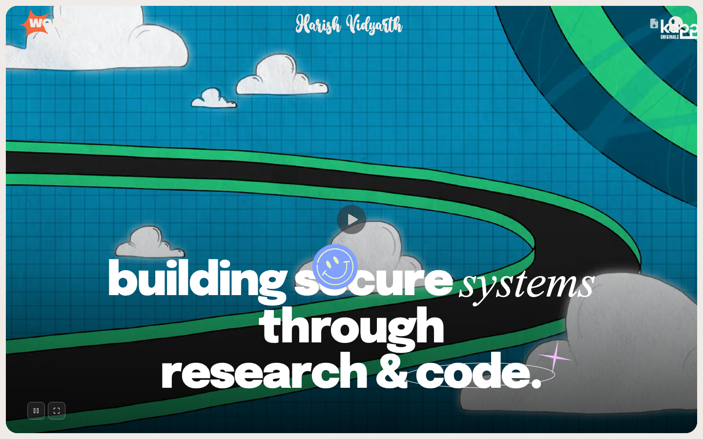
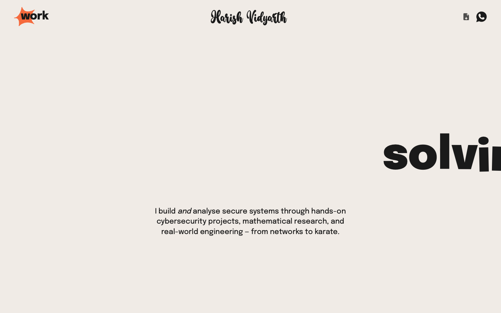
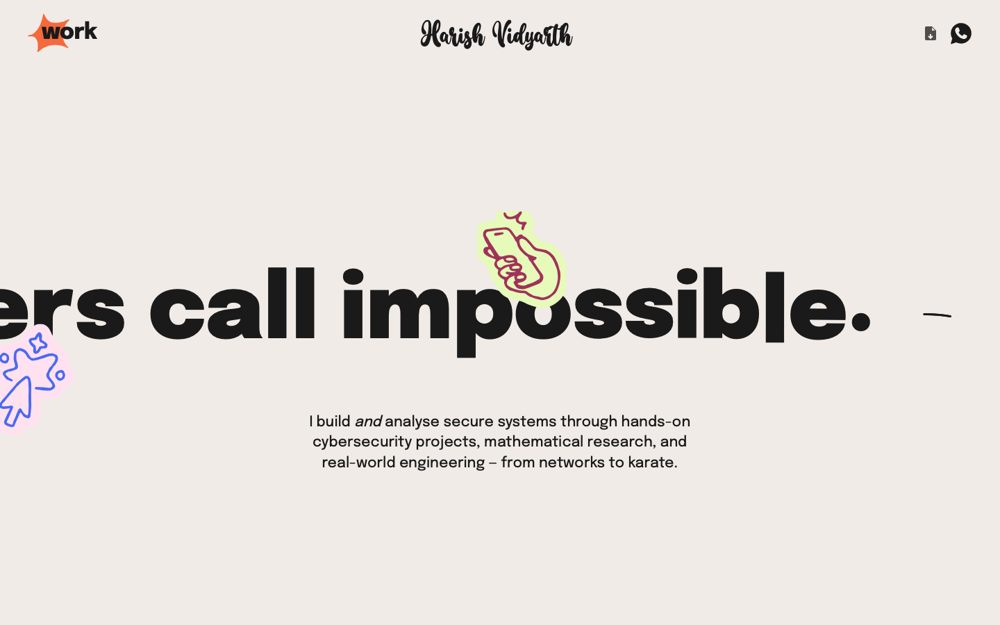
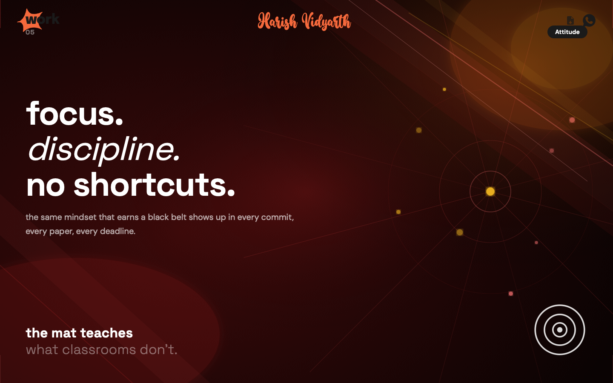

# Harish Vidyarth — Portfolio

**Live →** [harishvidyarth.vercel.app](https://harishvidyarth.vercel.app)

Personal portfolio of N. Harish Vidyarth — B.E. CSE (Cyber Security) student, SCI-published researcher, CTF competitor, 2nd Dan black belt, and keyboard player.

---

## Sections

| Section | Description |
|---|---|
| **Hero** | Full-screen video intro with mute/unmute controls |
| **Tagline** | Large GSAP-animated display heading — *"solving what others call impossible."* |
| **Research & Projects** | Sticky-scroll diagonal cards for each major project |
| **Project Showcase** | Hover/tap-to-reveal cards with GitHub links |
| **Skills** | Accordion cards — Cybersecurity · Research · Development · Achievements · Music |
| **Navbar** | Animated popouts: Work preview, WhatsApp contact, CV download |
| **Footer** | Contact CTA, social links |

---

## Stack

- **Framework** — Next.js 15 (App Router, no SSR — static-friendly)
- **Animations** — GSAP 3 + ScrollTrigger + InertiaPlugin
- **Smooth scroll** — Lenis
- **Styling** — Plain CSS (no Tailwind, no UI lib)
- **Fonts** — Epilogue, DM Sans, Space Grotesk, Bramesta
- **Deploy** — Vercel

---

## Run locally

```bash
npm install
npm run dev
# → http://localhost:3000
```

---

## Screenshots

| | |
|---|---|
|  |  |
|  |  |
